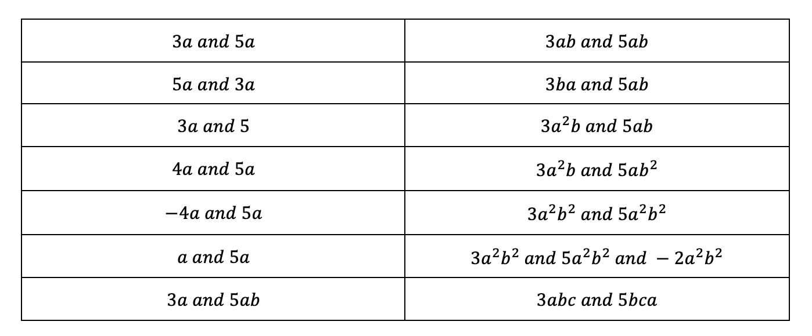

In my teaching of like terms, I did not provide the definition. Instead, I used a series of minimally different examples and non-examples to allow students to develop the concept.

This is based on Engelmann's Theory of Instruction, in particular the aspect of concept definition. Each subsequent example varies only in one aspect. For two subsequent examples, they must have one quality in common in order for students to infer what that quality says about the concept. Similarly, a positive and a negative example must only vary in one quality in order for the learner to infer that that quality is crucial to the concept.

In the first example above, $3a$ and $5a$, they are like terms. The second example involves switching the two around, but is still a positive example. So I am communicating to the students that switching them around has no impact on whether they are like terms or not. The third example involves changing the coefficient of one of the terms. This is still a positive examples, and from this students should be able to infer that the value of the coefficient does not change whether terms are like or not. Finally, the first negative example. The power $a$ in the first term is 2. This means they are not like terms. And so on.

How I approached this involved thinking of all the variations I could possibly make to the two terms:

Affects likeness:

* Types of coefficients
* Powers of coefficients

Does not affect likeness:

* Values of coefficients
* Negative coefficients
* Three or more terms (that are like) present
* Position of coefficients in the term
* Value of the powers (as long as they are the same, they could be any number)

Using a visualiser, I went down the list (left column first), and ticked or crossed for like or non-like terms. I would then cold call a student to tell me why they thought, compared to the previous example, why the pair were or were not like terms. After the sequence, students wrote down, in their own words, their understanding of the concept. I would cold call students to share, and provide feedback (and encourage other students to modify their definitions too).

I was concerned that students would struggle to generalise this to more complicated terms and expressions (involving more pronumerals, different powers or multiple terms). However, most students were able to identify like terms successfully in subsequent and rather complicated examples.

I think this is superior to providing a definition from the outset, as it allows students to focus on the constructing the schema for the concept. Afterwards, I asked students to verbalise their understanding. At this point I corrected them to use mathematical terminology, but only after they had begun to internalise the concept.